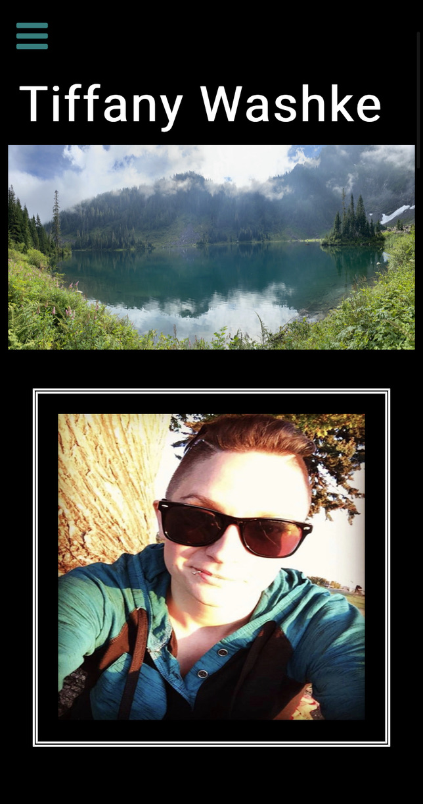

# Portfolio-Tiffany-Washke

A portfolio website about Tiffany Washke utilizing HTML, CSS, Bulma Framework, Google Fonts, and Javascript.  Designed to be mobile first, the portfolio was updated to include a link to a PDF Resume for potential employers to review.  The Work portion has been updated to include the most recent group project [Mood Tracker](https://chabivz.github.io/Mood-Tracker/) as well as other notable homework assignments.  In addition to the updated portfolio, both [LinkedIn](https://www.linkedin.com/in/tiffanywashke) and [GitHub](https://github.com/twashke) have been updated to include a biography, contact information and links to the portfolio.

## Table of Contents 

- [About the Project](#about-the-project)
- [Installation](#installation)
- [Usage](#usage)
- [Credit](#credit)
- [License](#license)

## About the Project

- Updated portfolio for Tiffany Washke utilizing HTML, CSS, Bulma Framework, Google Fonts, and Javascript. 
- Portfolio was designed to be mobile first and also fits desktop screens.
- A link to a PDF Resume has been added and opens to a new page.
- The Work section has been updated with the most current group project [Mood Tracker](https://chabivz.github.io/Mood-Tracker/) as well as other homework assignments ([Work Day Scheduler](https://twashke.github.io/Work-Day-Scheduler-Application/), [Weather Dashboard](https://twashke.github.io/Weather-Dashboard/), [Timed Coding Quiz](https://twashke.github.io/Timed-Coding-Quiz/)) and a placeholder linked to [Github](https://github.com/twashke).
- Project Information
- Project Information
- Project Information
- Project Information
- Built with the following technologies:
    - [Bulma](https://bulma.io/documentation/)
    - [bulma-debug.css](https://gist.github.com/JuanVqz/105c4910ff711659059c99492ecd1a5c) used to debug CSS layout
    - [Google Fonts](https://fonts.google.com/)
    - Javascript
    - HTML
    - CSS
- Comments have been added to the HTML, CSS and JS files to clarify each step and make future updates easier.

## Installation

- Open [Tiffany Washke Portfolio](https://twashke.github.io/Portfolio-Tiffany-Washke/) 
- Or, open index.html in the internet browser.

## Usage

- Go to [Deployed Github Page](https://twashke.github.io/Portfolio-Tiffany-Washke/)
- Project Usage
- Project Usage
- Project Usage
- Project Usage
- Project Usage
- Project Usage
- Project Usage
- Project Usage

GIF Title \
[GIF Description](Assets/images/)  \
\
Mobile First Design \
  \
\
Screenshot Title \
  \
\
Screenshot Title \
  \
\
Screenshot Title \
 

## Credit

- Previous code created by Tiffany Washke 2021
- [Bulma](https://bulma.io/documentation/)
- [bulma-debug.css](https://gist.github.com/JuanVqz/105c4910ff711659059c99492ecd1a5c) used to debug CSS layout
- [Google Fonts](https://fonts.google.com/)

## License

The MIT License (MIT)

Copyright (c) 2015 Chris Kibble

Permission is hereby granted, free of charge, to any person obtaining a copy of this software and associated documentation files (the "Software"), to deal in the Software without restriction, including without limitation the rights to use, copy, modify, merge, publish, distribute, sublicense, and/or sell copies of the Software, and to permit persons to whom the Software is furnished to do so, subject to the following conditions:

The above copyright notice and this permission notice shall be included in all copies or substantial portions of the Software.

THE SOFTWARE IS PROVIDED "AS IS", WITHOUT WARRANTY OF ANY KIND, EXPRESS OR IMPLIED, INCLUDING BUT NOT LIMITED TO THE WARRANTIES OF MERCHANTABILITY, FITNESS FOR A PARTICULAR PURPOSE AND NONINFRINGEMENT. IN NO EVENT SHALL THE AUTHORS OR COPYRIGHT HOLDERS BE LIABLE FOR ANY CLAIM, DAMAGES OR OTHER LIABILITY, WHETHER IN AN ACTION OF CONTRACT, TORT OR OTHERWISE, ARISING FROM, OUT OF OR IN CONNECTION WITH THE SOFTWARE OR THE USE OR OTHER DEALINGS IN THE SOFTWARE.